# Scrumptious!

Scrumptious! is a fictional company based at a fictional location in inner city Dublin.

Scrumptious!'s aim is to provide its users with food recipes that have been tried and tested by real chefs within their own kitchens.

This website helps customers find the recipe theyre looking for and provides clear and simple instructions on how to recreate the dish at home.

The website is for new customers discovering new recipes for the first time and for returning customers who are looking for a recipe they found before or to even try something new.

The website also offers a subscription to an email newsletter which keeps customers up to date when new recipes have been posted and information about live cooking demos taking place throughout the country.

Visit the deployed website [https://snappyjumper.github.io/Scrumptious/.](https://snappyjumper.github.io/Scrumptious/)

## Table of Contents

1. [User Experience (UX)](#user-experience-ux)
    1. [Project Goals](#project-goals)
    2. [User Stories](#user-stories)
    3. [Color Scheme](#color-scheme)
    4. [Typography](#typography)
    5. [Wireframes](#wireframes)
2. [Features](#features)
    1. [General](#general)
    2. [Home page](#home-page)
 3. [Technologies Used](#technologies-used)
    1. [Languages Used](#languages-used)
    2. [Frameworks, Libraries and Programs Used](#frameworks-libraries-and-programs-used)
4. [Testing](#testing)
    1. [Testing User Stories](#testing-user-stories)
    2. [Code Validation](#code-validation)
    3. [Accessibility](#accessibility)
    4. [Tools Testing](#tools-testing)
    5. [Manual Testing](#manual-testing)
5. [Finished Product](#finished-product)
6. [Deployment](#deployment)
    1. [GitHub Pages](#github-pages)
7. [Credits](#credits)
    1. [Content](#content)
    2. [Media](#media)
    3. [Code](#code)
8. [Acknowledgements](#acknowledgements)

***

## User Experience (UX)

### Project Goals

* The website should have a bright appearance with colors resembling that of fresh produce.

* Introduce the customer to what the company goals are.

* Present the recipes in a neat format with easy to understand instructions.

* Provide the customer with information that can help facilitate greater communication with the company.

* Offer the customers the opportunity to sign up to a Newsletter where they can recive updates on new recipes and upcomming events.

### User Stories

* As a customer, I want to be able to navigate the website easily and discover new recipes.

* As a customer, I want to be able to read more about what the company offers me.

* As a customer, I want to easily find the contact information for the business.

* As a customer, I want to find social media links associated with the business.

* As a customer, I want to be able to keep up to date with changes or events in the company.

* As a customer, I want to feel assured that these recipes are tried and tested.

### Color Scheme

The colours used in the 

### Typography

The main font used in the website is "Karla", from google fonts, with sans-serif as backup in case the font fails to display. The logo and headings are all styled with "Poetsen One"  

### Wireframes

[Balsamiq](https://balsamiq.com/) was used to help plan the finished look of the website and the wireframes I generated can be viewed below

Index Page:

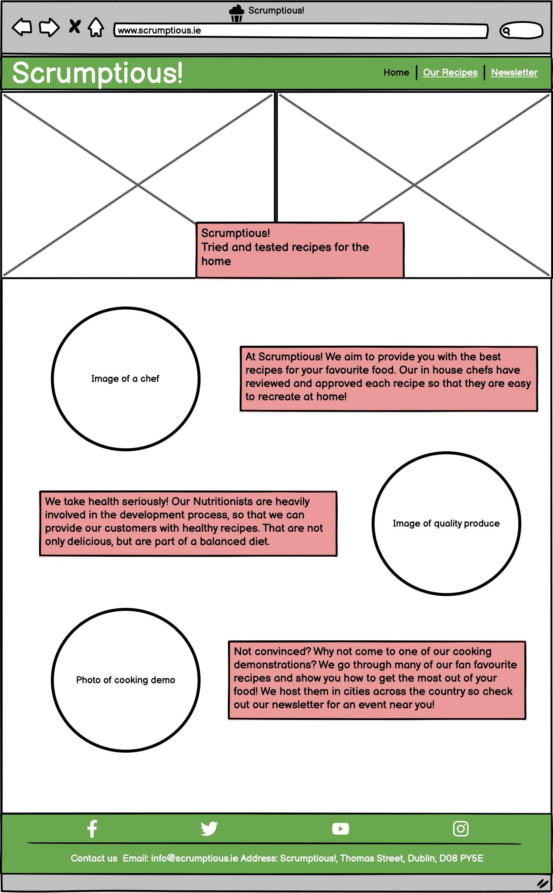

Our Recipes Page:

Newsletter Page:

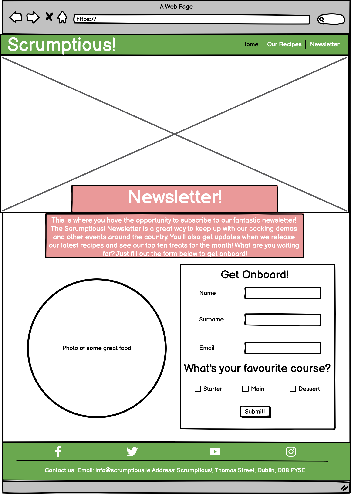

Mobile Page:

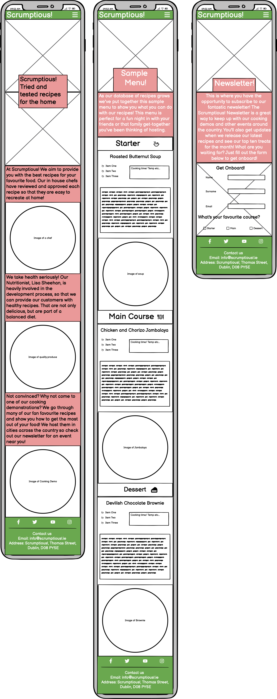

[Back to top ⇧](#scrumptious!)

## Features

### General

* Design was to be responsive across multiple devices.

* Colour schemes and similar layouts were to be maintained across all devices to enhance the user experience and make it easy to access information across different devices.

* **Header**

Desktop Header:

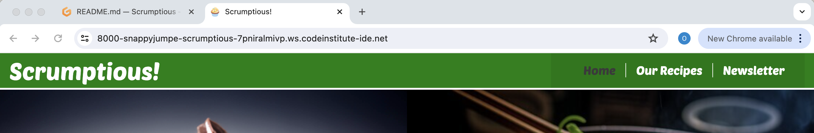

Mobile Header with Nav hidden:

Mobile Header with Nav shown:

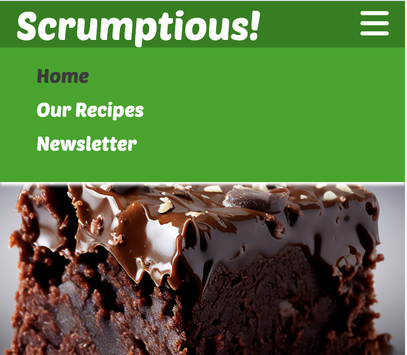

    
    - The header contains the company logo, which also serves as a link to the home page, and a fully functional navigation bar for moving between the pages of the website.
 
    - The header is fixed to the top of the window for easy access wherever you are on the page. 

    - The navigation bar is the same across all pages and highlights the active page.
 
    - The links in the navigation bar have a hover effect applied to them to enhance the user experience.
 
    - The navigation bar hides itself on smaller devices and can be accessed using a burger button.
 

* **Footer**

Desktop Footer:

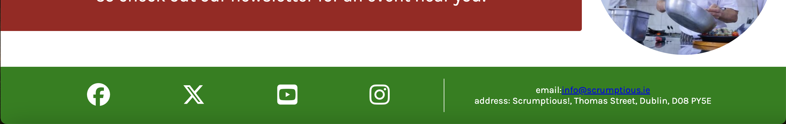

Mobile Footer:

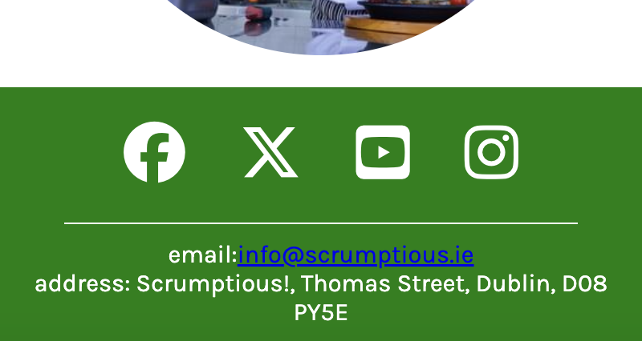

    - The footer contains links to social media sites.
 
    - The footer has contact information for the company, with a clickable link for email.

### Home Page

* **Main Image**

Desktop Main Images:

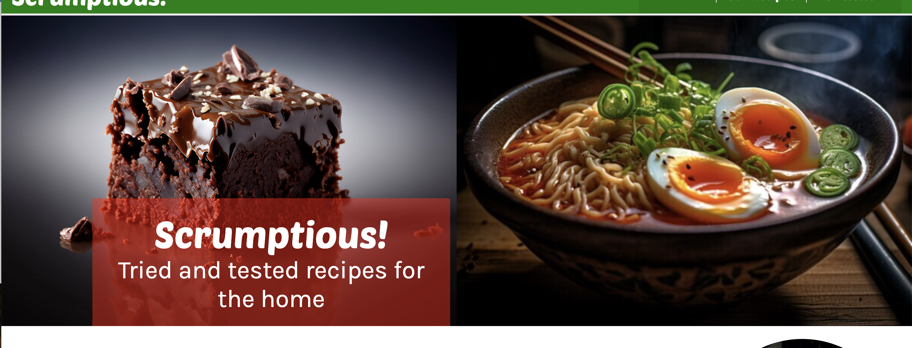

Mobile Main Images:

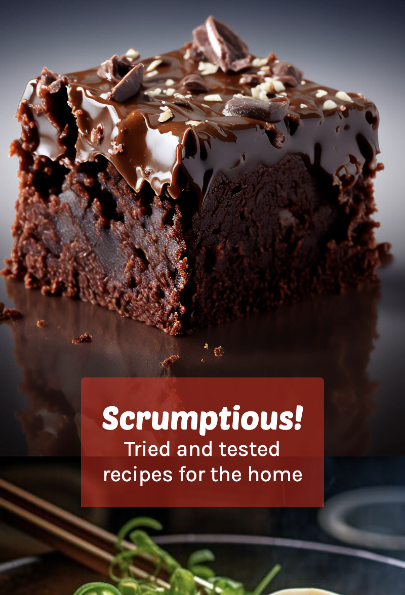

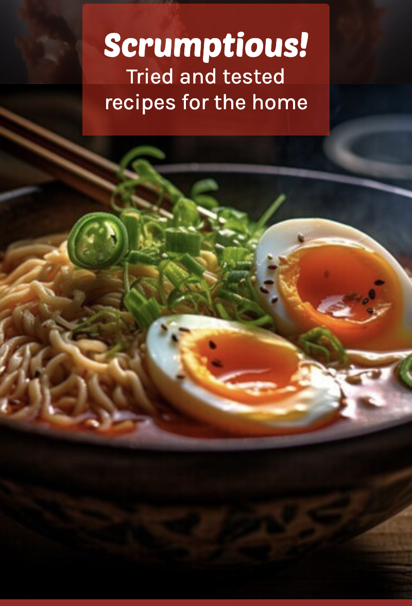

    - The two main images are designed to attract the customers attention and to let them know that this website is about food.

* **About Us Section**

Desktop Version:

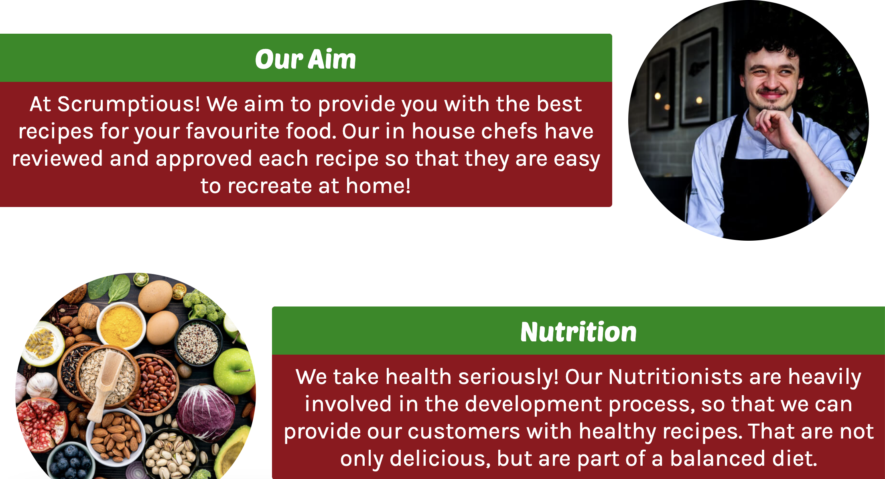

Mobile Version:

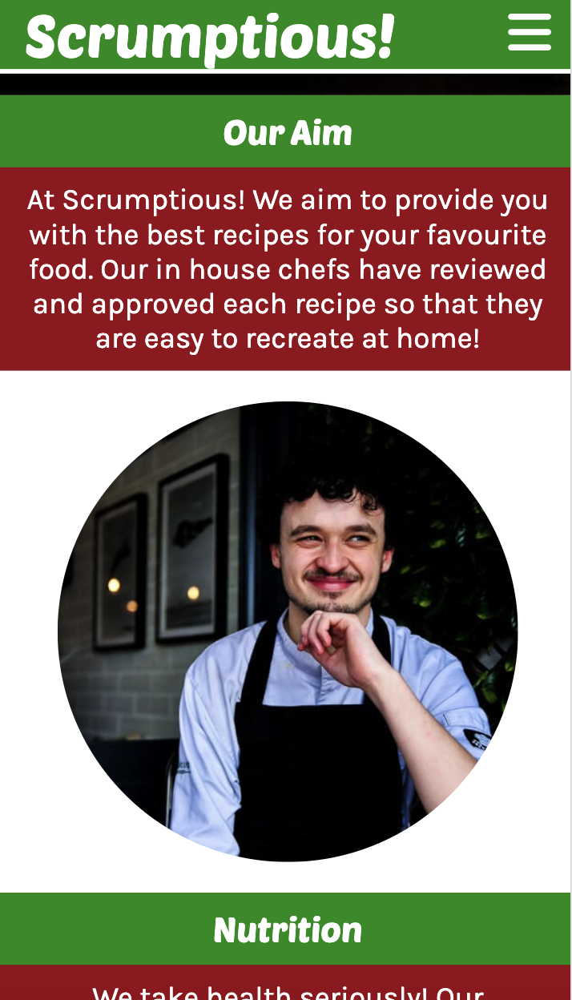

    - The rest of the page consists of eye catching images with brief descriptions. These outline what the company's goals are and what the function of this website is.

### Our Recipes Page

* **Sample Menu**

    - Until more recipes are gathered for the database the website shows a sample three course menu for a dinner party.

    - There is one specially selected meal for each of the three courses. A starter, a main and a dessert.

    - Each recipe is responsive and can be easily replicated to hold other recipes when adding more down the line.
 
    - Each recipe has a section for the ingredients, the cooking information and the instructions. They are laid out neatly for easy reading.

### Newsletter Page

* **Get Onboard Form**

    - The form allows the customer to submit their information so they can receive our newsletter.
 
    - The newsletter keeps them up to date with the recipes on the site and gives them information on life cooking demos taking place throughout the country.

[Back to top ⇧](#Scrumptious!)

## Technologies Used

### Languages Used
* [HTML5](https://en.wikipedia.org/wiki/HTML5)
* [CSS3](https://en.wikipedia.org/wiki/CSS)

### Frameworks, Libraries and Programs Used

* [Google Fonts](https://fonts.google.com/)
    - Google fonts was used to import the fonts "Poetsen One" and "Karla" which were used for the headings and body of the website respectively.

* [Font Awesome](https://fontawesome.com/)
     - Font Awesome was used for various icons throughout the website. These helped to improve the visual experience.

* [TinyPNG](https://tinypng.com/)
    - TinyPNG was used to help reduce the size of images used throughout the website.

* [GitPod](https://gitpod.io/)
     - GitPod was used to write the code and for pushing to Github.
* [GitHub](https://github.com/)
     - Github was used to keep the repository after pushing.

* [Balsamiq](https://balsamiq.com/)
     - Balsamiq was used during the design phase of the project to produce wireframes.

* [Chrome DevTools](https://developer.chrome.com/docs/devtools/)
    - Chrome Devtools was used during the development process to help troubleshoot code and test responsiveness.

* [W3C Markup Validator](https://validator.w3.org/)
    - W3C Markup Validator for validating HTML code.

* [W3C CSS Validator](https://jigsaw.w3.org/css-validator/)
    - W3C CSS Validator for validating CSS code.
 
* [Favicon.io](https://favicon.io/)
    - Favicon generator used to generate the favicon for the site.

* [CSS Scan](https://getcssscan.com/css-buttons-examples)
    - Samples of buttons styled through CSS

[Back to top ⇧](#Scrumptious!)

## Testing

### Testing User Stories

* As a customer, I want to be able to navigate the website easily and discover new recipes.

     - The website offers easy navigation throughout with a responsive navigation bar located in the header of each page.

    - The newsletter is a handy way for customers to encounter new recipes on a weekly basis.
 
    - Recipes are laid out in an easy to read format.

* As a customer, I want to be able to read more about what the company offers me.
  
    - The Home page gives a brief description about the services offered by the company.

    - Further information about cooking demos can be found on the weekly newsletter.

* As a customer, I want to easily find the contact information for the business.

    - The Footer on each page has a contact section which supplies the customer with an email address and a business address.

* As a customer, I want to find social media links associated with the business.

    - The Footer on each page has a social media section which contains easy to use icons with links to social media.

* As a customer, I want to be able to keep up to date with changes or events in the company.

    - The Newsletter page contains a simple form to subscribe to the Newsletter. The newsletter keeps customers up to date with all important changes and special events taking place at the company.

* As a customer, I want to feel assured that these recipes are tried and tested.

    - The Home page informs the customer that each of our recipes are tried and tested by the companies own chef team.
 
    - The cooking demos organised on the newsletter will use recipes on the site so customers feel assured they are quality recipes.

### Code Validation

* The [W3C Markup Validator](https://validator.w3.org/) and [W3C CSS Validator](https://jigsaw.w3.org/css-validator/) online services were used to ensure there were no errors in the code like syntax issues etc...

Test on index.html:

- The W3C Markup Validator found a /nav ending which was outside the div containing the nav. I fixed this error by moving the /nav to the correct location within the div.

- There was also a div id with an empty string associated with it. I deleted the unused id.

- There was a warning asking me to add some headers to the social media and contact us sections of the footer. I added hidden headings to correct this.

- The results of these adjustments gave a no errors or warnings result when the test was repeated.

Test on our-recipes.html:

- The W3C Markup Validator found that the sections for the circle images had no headings so I added them.

- There was a unused /i which i deleted.

- The same warning as the initial results from the index.html test suggested I added headings to the social network and contact us section so I did.

- The results of these adjustments gave a no errors or warnings result when the test was repeated.

Test on newsletter.html:

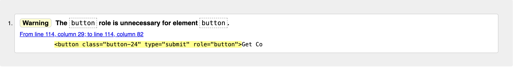

- The W3C Markup Validator found that I had an unused /div so i deleted it.

- The same warning arose with the footer as in the previous tests. I added headings to the social network and contact us sections to rectify the warning.

- There was also a warning with my button which i corrected by removing the role attribute.

- The results of these adjustments resulted in a no errors or warnings result when the test was repeated.

Test on style.css:

- W3C CSS Validator came up with no errors.

### Accessibility

* Used Lighthouse in Chrome DevTools to confirm that the colors and fonts being used in throughout the website are easy to read and accessible.

* Lighthouse reports

    - **Landing Page**

    

    - **Treatments Page**

    

    - **Book Now Page**

    

### Tools Testing

* [Chrome DevTools](https://developer.chrome.com/docs/devtools/)

    - Chrome DevTools was used right throught the development of this project to assist with troubleshooting code and styling.

* Responsiveness
    
    - [Am I Responsive?](http://ami.responsivedesign.is/#) was used to help check the sites responsiveness across a range of device sizes.

    - [Responsive Design Checker](https://www.responsivedesignchecker.com/) was used to help check responsiveness across a range of device sizes.
    
    - Chrome DevTools was used to help test the sites responsiveness across a range of devices during the development process.

### Manual Testing

* Browser Compatibility

    - The site was tested across a range of browsers including:

        - **Google Chrome**
        
        No issues with appearance, functionality or responsiveness were found.

        - **Safari**
        
        No issues with appearance, functionality or responsiveness were found.

        - **Mozilla Firefox**
        
        No issues with appearance, functionality or responsiveness were found.

        - **Microsoft Edge**
        
        No issues with appearance, functionality or responsiveness were found.

* Device compatibility

    - The website has been tested on multiple devices, including:

        - **MacBook Pro 13"**

        No issues with appearance, functionality or responsiveness were found.

        - ****

        No issues with appearance, functionality or responsiveness were found.

        - **iPad Pro 12.9"**

        No issues with appearance, functionality or responsiveness were found.

        - **iPad Pro 10.5"**

        No issues with appearance, functionality or responsiveness were found.

        - **OnePlus 10 Pro**
        
        No issues with appearance, functionality or responsiveness were found.

        - **iPhone 7**

        No issues with appearance, functionality or responsiveness were found.

* Common Elements Testing

    - All Pages
        
        - **Header**

            - By clicking on the Scrumptious Logo you are directed to the home page.

        - **Navigation Bar**

            - Hovering with the cursor over different options on the navigation bar will cause them to highlight.

            - Clicking on one of the options within the navigation bar will direct you to its corresponding page.

            - The page that you are currently on is greyed out as an option in the navigation bar.
        
        - **Footer**
        
            - By clicking on one of the social media icons you are directed to the relevant social media website.

            - By clicking on the email address in the contact us section of the footer you are brought to the compose an email section of your computers email software.

    - Our Recipes Page

        - 

        - 

    - Newsletter Page

        - When filling out the Get Onboard form on the Newsletter page you are required to fill out each input before submitting. 
        
        - Hovering with your cursor over the Get Cookin' button causes its colours to reverse.

        - Clicking the Get Cookin' button causes its to go slightly transparent.
        

[Back to top ⇧](#Scrumptious!)

## Finished Product

[Back to top ⇧](#Scrumptious!)

## Deployment

* This website was developed using [GitPod](https://www.gitpod.io/), which was pushed and commited to GitHub using the terminal on GitPod.

### GitHub Pages

* Here are the steps to deploy this website to GitHub Pages from its GitHub repository:

    1. Log into GitHub and find the repository associated with the project [GitHub Repository](https://github.com/).

    2. At the top of the repository locate the settings and click.

    3. Within settings locate the pages section.

    4. In source, change the dropdown menu option from none to Master Branch.

    5. The page should then refresh and generate a link to your site.

[Back to top ⇧](#Scrumptious!)

## Credits 

### Content

- All content was written by the developer.

### Media

* [Vecteezy.com](https://www.vecteezy.com/)

- All images, except for the Chef image were downloaded for free from vecteezy.com.

* [Favicon.io](https://favicon.io/)

- The cupcake favicon was downloaded for free from https://favicon.io/.

### Code

* [Stack Overflow](https://stackoverflow.com/) and [W3Schools](https://www.w3schools.com/) were both used on a regular basis to assist with development of the code.

* [Code Institute](https://www.codeinstitute.ie/) their tutorials and sample project were useful for both the development and inspiration of my own.

* [Codecademy](https://www.codecademy.com/) was used to help with trying to further understand some of the material from the Code Institute course.

[Back to top ⇧](#Scrumptious!)

## Acknowledgements

* My housemate, for his support and guidance throughout this project.

* My partner, for her support and the lend of her iPhone while testing.

* My mentor, Marcel, for his solid advice and suggestions during this project.

* My parents, for financial and emotional support during this course.

* Code Institute and its great community for additional support and guidance throughout this course so far.

[Back to top ⇧](#Scrumptious!)
