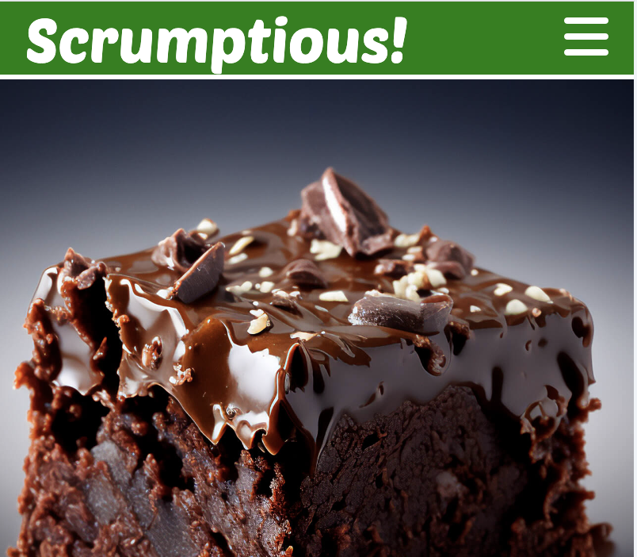

# Scrumptious!

Scrumptious! is a fictional company based at a fictional location in inner city Dublin.

Scrumptious!'s aim is to provide its users with food recipes that have been tried and tested by real chefs within their own kitchens.

This website helps customers find the recipe they're looking for and provides clear and simple instructions on how to recreate the dish at home.

The website is for new customers discovering new recipes for the first time and for returning customers who are looking for a recipe they found before or to even try something new.

The website also offers a subscription to an email newsletter which keeps customers up to date when new recipes have been posted and information about live cooking demos taking place throughout the country.

Visit the deployed website [https://snappyjumper.github.io/Scrumptious/.](https://snappyjumper.github.io/Scrumptious/)

## Table of Contents

1. [User Experience (UX)](#user-experience-ux)
    1. [Project Goals](#project-goals)
    2. [User Stories](#user-stories)
    3. [Color Scheme](#color-scheme)
    4. [Typography](#typography)
    5. [Wireframes](#wireframes)
2. [Features](#features)
    1. [General](#general)
    2. [Home page](#home-page)
 3. [Technologies Used](#technologies-used)
    1. [Languages Used](#languages-used)
    2. [Frameworks, Libraries and Programs Used](#frameworks-libraries-and-programs-used)
4. [Testing](#testing)
    1. [Testing User Stories](#testing-user-stories)
    2. [Code Validation](#code-validation)
    3. [Accessibility](#accessibility)
    4. [Tools Testing](#tools-testing)
    5. [Manual Testing](#manual-testing)
5. [Finished Product](#finished-product)
6. [Deployment](#deployment)
    1. [GitHub Pages](#github-pages)
7. [Credits](#credits)
    1. [Content](#content)
    2. [Media](#media)
    3. [Code](#code)
8. [Acknowledgments](#acknowledgments)

***

## User Experience (UX)

### Project Goals

* The website should have a bright appearance with colors resembling that of fresh produce.

* Introduce the customer to what the company goals are.

* Present the recipes in a neat format with easy to understand instructions.

* Provide the customer with information that can help facilitate greater communication with the company.

* Offer the customers the opportunity to sign up to a Newsletter where they can recieve updates on new recipes and upcoming events.

### User Stories

* As a customer, I want to be able to navigate the website easily and discover new recipes.

* As a customer, I want to be able to read more about what the company offers me.

* As a customer, I want to easily find the contact information for the business.

* As a customer, I want to find social media links associated with the business.

* As a customer, I want to be able to keep up to date with changes or events in the company.

* As a customer, I want to feel assured that these recipes are tried and tested.

### Color Scheme

The colours used on the website are above. I used the two shades of green, India Green and Kelly Green(#028A0F and #03AC15), to colour the headings and the nav bar in the mobile version of the site respectively. I used the shade of Red Carmine to colour the banners and boxes throughout the website as well as the email link within the footer. These colours were chosen because of their familiar shades to fresh produce like peppers and brocolli. For the text I stuck with a white colour (#FFFFFF). 

### Typography

The main font used on the website is "Karla", from google fonts, with sans-serif as backup in case the font fails to display. The logo and headings are all styled with "Poetsen One", with sans-serif as a fall back again.  

### Wireframes

[Balsamiq](https://balsamiq.com/) was used to help plan the finished look of the website and the wireframes I generated can be viewed below

Index Page:

Our Recipes Page:

Newsletter Page:

Mobile Page:

[Back to top ⇧](#scrumptious!)

## Features

### General

* Design was to be responsive across multiple devices.

* Colour schemes and similar layouts were to be maintained across all devices to enhance the user experience and make it easy to access information across different devices.

**Header**

Desktop Header:

Mobile Header with Nav hidden:

Mobile Header with Nav shown:

    
- The header contains the company logo, which also serves as a link to the home page, and a fully functional navigation bar for moving between the pages of the website. 

- The header is fixed to the top of the window for easy access wherever you are on the page. 

- The navigation bar is the same across all pages and highlights the active page, which helps users know where they are as they browse the site.

- The links in the navigation bar have a hover effect applied to them to enhance the user experience.

- The navigation bar hides itself on smaller devices and can be accessed using a burger button. This is useful as the nav bar takes up a lot of horizontal space and having it hidden means the header can stay small and not impact the screen space.
 

**Footer**

Desktop Footer:

Mobile Footer:

- The footer contains links to social media sites. These links highlight when you hover over with the cursor and each link is displayed as an icon relating to the relative social media site.

- Clicking one of the social media icons opens up the corresponding site in a separate tab. This is a useful feature so the customer can easily navigate back to the Scrumptious! site via the old tab.

- The footer has contact information for the company, with a clickable link for email. The link opens up the customers default email program and starts a new mail with the sites email as it's recipient. This feature is good for the user experience.

### Home Page

 **Main Image**

Desktop Main Images:

Mobile Main Images:

- The two main images are designed to attract the customers attention and to let them know that this website is about food.

- Two images were chosen so the customer knows that the site is about more than just desserts. The ramen hero image shows that the site also has recipes for savory dishes, as well as sweet ones depicted with the brownie hero image. 

 **About Us Section**

Desktop Version:

Mobile Version:

- The rest of the page consists of eye-catching images with brief descriptions. These outline what the company's goals are and what the function of this website is.

- The first paragraph talks about the aim of the site. To match the customer with a recipe that has been tried and tested by our own chefs. This gives the customer a solid idea of what to expect from the site.

- This is coupled with an image of one of the chefs musing over some of the fantastic recipes he's testing that day.

- The second paragraph talks about Nutrition. It explains that all the recipes are put together with good nutrition at their core. This reassures the customers that the recipes supplied are going to be healthy which entices more health concerned customers to the site.

- This is coupled with an image of fresh produce to compliment the idea of a balanced diet and healthy nutrition.

- The Third paragraph talks about the cooking demos. These cooking demos offer customers an opportunity to get some hands on experience with the recipes. The paragraph also mentions the newsletter to get more information. Mentioning the newsletter will encourage customers to navigate further into the site.

### Our Recipes Page

- The page begins with a hero image displaying a set table ready for a dinner party. This provides the customer with an idea where they can use the recipes below.

 **Sample Menu**

Recipe Container:

Accompanying Image:

- Until more recipes are gathered for the database the website shows a sample three course menu for a dinner party. In future this page will serve as a base to navigate to recipes throughout the site across all types of courses.

- There is one specially selected meal for each of the three courses. A starter, a main and a dessert. This gives the customer some range and reminds them that the site will host a diverse selection of recipes in the future

- Each recipe is responsive and can be easily replicated to hold other recipes when adding more down the line. This enhances the user experience on mobile devices and makes it useful for the site owner when adding recipes, as there will be an existing template to work off of.

- Each recipe has a section for the ingredients, the cooking information and the instructions. They are laid out neatly for easy reading. This is key as the accessibility of each recipe to the customer is part of the main goals of the site.

- Each recipe also has an accompanying image of the finished product. This is essential not only for the customer to be able to compare their work but also to entice them to try the recipe.

### Newsletter Page

[Newsletter Hero Image](assets/readme-images/newsletter-hero.png)

- The hero image on the newsletter page shows a chef hard at work kneading dough. 

- Below the heading of the page we also have a paragraph about what the newsletter offers the customer. This will help to encourage customers to sign up which in turn will encourage repeat visits to the site.

 **Get Onboard Form**

Desktop Version:

Mobile Version:

- The form allows the customer to submit their information, so they can receive our newsletter. 

- Everything is laid out nice and easy and the sign up is kept nice and simple with a name, surname and email input and a radio button selection on the customers favourite course. Keeping this simple is essential as lengthly signup pages can discourage customers.

- The radio button selection will help deliver a more personalised experience further down the line. The newsletter could be adapted to lean heavier on the customers preferred course.

- The newsletter keeps them up to date with the recipes on the site and gives them information on live cooking demos taking place throughout the country. The more up to date the customer is with the latest recipes and events posted on the site, the larger return visits the site will have as a result.

- The form is accompanied by an image of food being seasoned.

[Back to top ⇧](#Scrumptious!)

## Technologies Used

### Languages Used
* [HTML5](https://en.wikipedia.org/wiki/HTML5)
* [CSS3](https://en.wikipedia.org/wiki/CSS)

### Frameworks, Libraries and Programs Used

* [Google Fonts](https://fonts.google.com/)
    - Google fonts was used to import the fonts "Poetsen One" and "Karla" which were used for the headings and body of the website respectively.

* [Font Awesome](https://fontawesome.com/)
    - Font Awesome was used for various icons throughout the website. These helped to improve the visual experience.

* [TinyPNG](https://tinypng.com/)
    - TinyPNG was used to help reduce the size of images used throughout the website.

* [GitPod](https://gitpod.io/)
    - GitPod was used to write the code and for pushing to Github.

* [GitHub](https://github.com/)
    - Github was used to keep the repository after pushing.

* [Balsamiq](https://balsamiq.com/)
    - Balsamiq was used during the design phase of the project to produce wireframes.

* [Chrome DevTools](https://developer.chrome.com/docs/devtools/)
    - Chrome Devtools was used during the development process to help troubleshoot code and test responsiveness.

* [W3C Markup Validator](https://validator.w3.org/)
    - W3C Markup Validator for validating HTML code.

* [W3C CSS Validator](https://jigsaw.w3.org/css-validator/)
    - W3C CSS Validator for validating CSS code.
 
* [Favicon.io](https://favicon.io/)
    - Favicon generator used to generate the favicon for the site.

* [CSS Scan](https://getcssscan.com/css-buttons-examples)
    - Samples of buttons styled through CSS

[Back to top ⇧](#Scrumptious!)

## Testing

### Testing User Stories

* As a customer, I want to be able to navigate the website easily and discover new recipes.

     - The website offers easy navigation throughout with a responsive navigation bar located in the header of each page.

    - The newsletter is a handy way for customers to encounter new recipes on a weekly basis.
 
    - Recipes are laid out in an easy to read format.

* As a customer, I want to be able to read more about what the company offers me.
  
    - The Home page gives a brief description about the services offered by the company.

    - Further information about cooking demos can be found on the weekly newsletter.

* As a customer, I want to easily find the contact information for the business.

    - The Footer on each page has a contact section which supplies the customer with an email address and a business address.

* As a customer, I want to find social media links associated with the business.

    - The Footer on each page has a social media section which contains easy to use icons with links to social media.

* As a customer, I want to be able to keep up to date with changes or events in the company.

    - The Newsletter page contains a simple form to subscribe to the Newsletter. The newsletter keeps customers up to date with all important changes and special events taking place at the company.

* As a customer, I want to feel assured that these recipes are tried and tested.

    - The Home page informs the customer that each of our recipes are tried and tested by the companies own chef team.
 
    - The cooking demos organised on the newsletter will use recipes on the site so customers feel assured they are quality recipes.

### Code Validation

* The [W3C Markup Validator](https://validator.w3.org/) and [W3C CSS Validator](https://jigsaw.w3.org/css-validator/) online services were used to ensure there were no errors in the code like syntax issues etc...

Test on index.html:

- The W3C Markup Validator found a /nav ending which was outside the div containing the nav. I fixed this error by moving the /nav to the correct location within the div.

- There was also a div id with an empty string associated with it. I deleted the unused id.

- There was a warning asking me to add some headers to the social media and contact us sections of the footer. I added hidden headings to correct this.

- The results of these adjustments gave a no errors or warnings result when the test was repeated.

Test on our-recipes.html:

- The W3C Markup Validator found that the sections for the circle images had no headings, so I added them.

- There was a unused /i which i deleted.

- The same warning as the initial results from the index.html test suggested I added headings to the social network and contact us section, so I did.

- The results of these adjustments gave a no errors or warnings result when the test was repeated.

Test on newsletter.html:

- The W3C Markup Validator found that I had an unused /div so i deleted it.

- The same warning arose with the footer as in the previous tests. I added headings to the social network and contact us sections to rectify the warning.

- There was also a warning with my button which i corrected by removing the role attribute.

- The results of these adjustments resulted in a no errors or warnings result when the test was repeated.

Test on style.css:

- W3C CSS Validator came up with no errors.

### Accessibility

* Used Lighthouse in Chrome DevTools to confirm that the colors and fonts being used in throughout the website are easy to read and accessible.

* Lighthouse reports

    - **Home Page**

    

    - **Our Recipes Page**

    

    - **Newsletter Page**

    

### Tools Testing

* [Chrome DevTools](https://developer.chrome.com/docs/devtools/)

    - Chrome DevTools was used right through out the development of this project to assist with troubleshooting code and styling.

* Responsiveness
    
    - [Am I Responsive?](http://ami.responsivedesign.is/#) was used to help check the sites responsiveness across a range of device sizes.

    - [Responsive Design Checker](https://www.responsivedesignchecker.com/) was used to help check responsiveness across a range of device sizes.
    
    - Chrome DevTools was used to help test the sites responsiveness across a range of devices during the development process.

### Manual Testing

* Browser Compatibility

    - The site was tested across a range of browsers including:

        - **Google Chrome**
        
        No issues with appearance, functionality or responsiveness were found.

        - **Safari**
        
        No issues with appearance, functionality or responsiveness were found.

        - **Mozilla Firefox**
        
        No issues with appearance, functionality or responsiveness were found.

        - **Microsoft Edge**
        
        No issues with appearance, functionality or responsiveness were found.

* Device compatibility

    - The website has been tested on multiple devices, including:

        - **MacBook Pro 13"**

        No issues with appearance, functionality or responsiveness were found.

        - **Acer Aspire V**

        No issues with appearance, functionality or responsiveness were found.

        - **iPad Pro 13"**

        No issues with appearance, functionality or responsiveness were found.

        - **OnePlus 10 Pro**
        
        No issues with appearance, functionality or responsiveness were found.

        - **IPhone 15**

        No issues with appearance, functionality or responsiveness were found.

* Common Elements Testing

    - All Pages
        
        - **Header**

            - By clicking on the Scrumptious Logo you are directed to the home page. A useful option if the customer gets lost.

        - **Navigation Bar**

            - Hovering the cursor over Home (unless it's the active page) highlights the word.

            - Hovering the cursor over Our Recipes (unless it's the active page) highlights the word.

            - Hovering the cursor over Newsletter (unless it's the active page) highlights the word.

            - Clicking on the Home option brings the user to the home page.

            - Clicking on the Our Recipes option brings the user to the our recipes page.

            - Clicking on the Newsletter option brings the user to the newsletter page.

            - The page that the user is currently on is greyed out as an option in the navigation bar.

            - When the page is viewed on a small tablet or mobile device the nav bar is hidden.

            - Clicking on the burger button displays the nav bar and it drops down vertically below the header.
        
        - **Footer**
    
            - By Hovering over the Facebook icon with the cursor it highlights. Clicking on it then opens a new tab which immediately directs the user to the Facebook homepage (Will be changed to the Scrumptious Facebook page in future).

            - By hovering over the X icon with the cursor it highlights. Clicking on it then opens a new tab which immediately directs the user to the X homepage (Will be changed to the Scrumptious X page in future).

            - By hovering over the Youtube icon with the cursor it highlights. Clicking on it then opens a new tab which immediately directs the user to the Youtube homepage (Will be changed to the Scrumptious Youtube page in the future).

            - By hovering over the Instagram icon with the cursor it highlights . Clicking on it then opens a new tab which immediately directs the user to the Instagram homepage (Will be changed to the Scrumptious Instagram page in the future). 

            - By clicking on the email address in the contact us section of the footer you are brought to the compose an email section of your computers email software.

            - When the pages are viewed on a mobile device the font size increases on the contact us info. They also stack in a column formation with the social media icons and there's a border between them.

            - When the pages are viewed on a desktop the icons spread out and flip to a row formation with the contact us info, and a small border line comes between them.

    - Home Page

        - The page responds to different device sizes.

        - On a mobile device:
            
            - The Hero images display one on top of the other with the heading overlapping between them.

            - The Our Aim, Nutrition and Not Convinced? paragraphs stack up in column formation with their respective images underneath each one.

        - On a tablet or laptop:

            - The hero images display in a row and the title sits within the brownie image at the bottom.

            - The Our Aim, Nutrition and Not Convinced? paragraphs pair off with their respective images and display as a row with their image. These paragraphs and images are then displayed in a column over one another. The order of the paragraph and image of the Nutrition section are reversed.

        - On a Larger desktop:

            - The Images accompanying the paragraphs get bigger to occupy more screen space.     

    - Our Recipes Page

        - The hero image, heading and the descriptive paragraph remain the same across all devices, adjusting properly for screen size.

        - The page responds to different device sizes.

        - On a mobile device:

            - The recipe and its image display in a column formation, and they too are in columns with the other recipes.

            - All the information inside the recipe is displayed in a column formation.

        - On a tablet or larger:

            - Within the recipe the Ingredients and Cooking Info flip to a row formation. they then display over the Method in a column formation.

            - The recipe displays alongside its image in a row formation with the order reversed for the Main Course.

            - Each course is displayed in a column formation as in the mobile version.

    - Newsletter Page

        - When filling out the Get Onboard form on the Newsletter page you are required to fill out each input before submitting.

            - When name, surname or email address are left blank a warning pops up requiring you to enter information

            - When any input put into the email section is not an email address (doesn't contain an @ symbol) a warning will display requiring you to correct your input. 
        
        - Hovering with your cursor over the Get Cookin' button causes its colours to reverse.

        - Clicking the Get Cookin' button causes its to go slightly transparent.

        - The hero image, title and brief description remain the same across all devices and adjust to the different sizes.

        - The page responds to different device sizes.

            - On a mobile device the signup image and Get Onboard Form display in a column formation.

            - On a tablet or larger the signup image and Get On Board form flip into a row formation.

[Back to top ⇧](#Scrumptious!)

## Finished Product

Index Page:

Our Recipes Page:

Newsletter Page:

[Back to top ⇧](#Scrumptious!)

## Deployment

* This website was developed using [GitPod](https://www.gitpod.io/), which was pushed and commited to GitHub using the terminal on GitPod.

### GitHub Pages

* Here are the steps to deploy this website to GitHub Pages from its GitHub repository:

    1. Log into GitHub and find the repository associated with the project [GitHub Repository](https://github.com/).

    2. At the top of the repository locate the settings and click.

    3. Within settings locate the pages section.

    4. In source, change the dropdown menu option from none to Master Branch.

    5. The page should then refresh and generate a link to your site.

[Back to top ⇧](#Scrumptious!)

## Credits 

### Content

- All content was written by the developer.

### Media

* [Vecteezy.com](https://www.vecteezy.com/)

     All images, except for the Chef image were downloaded for free from vecteezy.com.

* [Favicon.io](https://favicon.io/)

     The cupcake favicon was downloaded for free from https://favicon.io/.

### Code

* [Stack Overflow](https://stackoverflow.com/) and [W3Schools](https://www.w3schools.com/) were both used on a regular basis to assist with development of the code.

* [Code Institute](https://www.codeinstitute.ie/) their tutorials and sample project were useful for both the development and inspiration of my own.

* [Codecademy](https://www.codecademy.com/) was used to help with trying to further understand some of the material from the Code Institute course.

[Back to top ⇧](#Scrumptious!)

## Acknowledgments

* My housemate, for his support and guidance throughout this project.

* My partner, for her support and the lend of her iPhone while testing.

* My mentor, Marcel, for his solid advice and suggestions during this project.

* My parents, for financial and emotional support during this course.

* Code Institute and its great community for additional support and guidance throughout this course so far.

[Back to top ⇧](#Scrumptious!)
